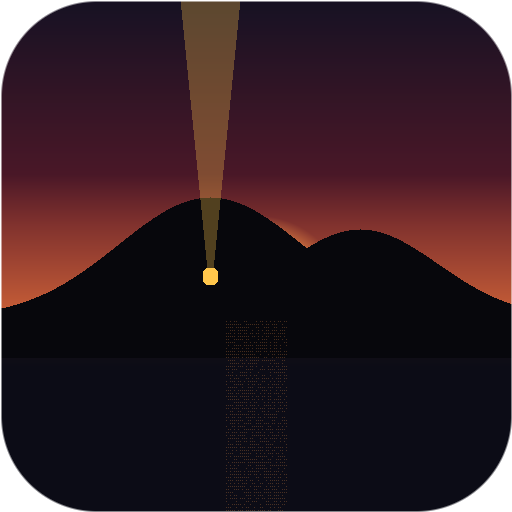

   

<h1 align="center">M A R O O N</h1>

<i>you, your friends, and the wilderness</i> 
by <b>mrrzone</b> · <a href="https://braindumpia.web.app">Brain Dump Inneractive</a>

  <a href="https://maroongame.web.app"><b>🌐 maroongame.web.app</b></a> ·
  <a href="https://github.com/gremstard/maroon/releases/latest/download/Maroon-Windows.exe"><b>⬇ Windows</b></a> ·
  <a href="https://github.com/gremstard/maroon/releases/latest/download/Maroon-macOS.zip"><b>⬇ macOS</b></a>

---

You wash ashore with nothing. Not even a shirt.

Maroon is a co-op survival island for **2–8 friends** — the creativity of
Minecraft, the grit of Rust, the readability of Unturned — built on one
unbreakable rule and one unusual promise:

> **You cannot hurt other survivors. The game won't let you.**
> And unlike every survival game you've played — **this one can be beaten.**

No chat. No griefing. No wipes. Just you, the people you brought, and an
island that absolutely will not make it easy.

## What that looks like

🌿 **Forage like you mean it.** No punching trees. Fallen branches, fiber
pulled from dry grass, string twisted by hand — then your first crude axe,
and the whole island opens up.

🗺 **Quest chains, not checklists.** The shipwreck you washed in on holds the
captain's journal. The journal points inland. The key is inside a wolf. The
chain ends with a signal beacon burning on the island's peak — and something
enormous answering from beyond the reef.

🏠 **Build a real home.** Snap-together foundations, walls, doorways, window
shutters, thatched roofs — and a claim totem you must keep fed, or the rot
takes everything back.

🐗 **Creatures with one rule each.** Stand perfectly still and the bear loses
interest. Never meet a boar's eyes. The cave dweller fears only torchlight.
Learn the rule, or wear the scar.

⚔️ **Gear you can read at a glance.** Fiber → hide → iron → leviathan scale.
There's no chat, so what your friends wear *is* their story.

⛵ **Two islands, one sea.** A moonstone from the Sea Cave builds your raft.
Past the reef: the Far Isle — richer veins, hungrier things, and a monolith
that wants exactly three moonstones.

🌙 **And it ends.** Beat the chains, light the beacon, slay the Leviathan,
wake the monolith — and one day, the island is simply *yours*. That's the
plan through 1.0: survive the hard game, earn the peaceful one.

## Get it

| | |
|---|---|
| **Windows** | [Maroon-Windows.exe](https://github.com/gremstard/maroon/releases/latest/download/Maroon-Windows.exe) — one file, run it. SmartScreen: *More info → Run anyway* (unsigned early build). |
| **macOS** | [Maroon-macOS.zip](https://github.com/gremstard/maroon/releases/latest/download/Maroon-macOS.zip) — unzip, **right-click → Open** the first time. If macOS says *"Maroon is damaged"*, it isn't — that's Gatekeeper on an unsigned download: run `xattr -cr <path-to>/Maroon.app` in Terminal, or System Settings → Privacy & Security → *Open Anyway*. |
| **Website** | [maroongame.web.app](https://maroongame.web.app) |

## Playing together

Maroon is friends-only co-op — no accounts, no matchmaking, no strangers.

- **Same house / LAN:** one of you clicks **New World** (or **Continue**);
  everyone else picks **Join a World** and enters the host's local IP
  (the host can find it in their network settings, usually `192.168.x.x`).
- **Across the internet, the easy way:** everyone installs
  [Tailscale](https://tailscale.com) (free) and joins the same tailnet; the
  host shares their Tailscale IP. No router surgery, works from anywhere.
- **Across the internet, the classic way:** the host forwards **UDP port
  27455** on their router to their machine and shares their public IP.
- Worlds you've joined are remembered under **Added Worlds** — one click to
  return. The host's world autosaves; host the same seed to continue it,
  and your character follows you between worlds.

*(Steam — with invites, achievements and cloud saves — is on the
[roadmap](DESIGN.md) for 1.0.)*

## For the curious

- **[Build & run from source →](docs/BUILDING.md)** — Godot 4.7, one command,
  no other dependencies. Dedicated servers, dev flags, exports.
- **[Design document →](DESIGN.md)** — the full vision: the Long Game,
  biomes, the road to 1.0, and why PnPvE is the whole point.

---

Maroon is free. Made with Godot.
A <a href="https://braindumpia.web.app">Brain Dump Inneractive</a> game.

